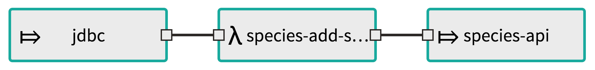
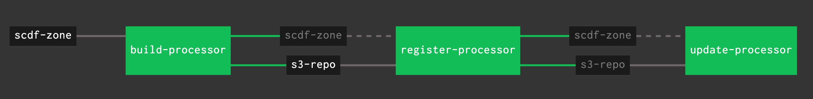

# SCDF demo
Collection of sample apps to demo SCDF Streams and Tasks on Spring Cloud Data Flow for PCF.
Tested with SCDF for PCF Server 1.2.0 (SCDF Server v1.6.3)

[Preparation](#preparation)

[SCDF Stream demo](#scdf-stream-demo)

[SCDF Task demo](#scdf-task-demo)

[SCDF Concourse demo](#scdf-concourse-demo)

## Preparation
These steps should be completed before delivering the demo

1. Install SCDF for PCF
    - Download tile: https://network.pivotal.io/products/p-dataflow
    - Installation Instructions: https://docs.pivotal.io/scdf/1-1/installing.html


1. Create SCDF Server Service instance
    ```
    cf cs p-dataflow standard dataflow
    ```

1. Create MySQL Service Instance for Species Database
    ```
    cf cs p.mysql db-small mymysql
    ```

1. Load data into Database
    - One option is to deploy Pivotal MySQL Web tool to manage DB. This is handy now to create the schema and import the data, but also later on to update the tag of the rows.
      - App location: https://github.com/pivotal-cf/PivotalMySQLWeb
      - UI credentials: admin / cfmysqlweb
      - Create schema using `/db/species_nyc_schema.sql` in this repo.
      - Import data using `/db/species_nyc_small.sql` or `/db/species_nyc.sql` in this repo, depending on how much data you want to load.

1. Bulk import stream app starters
    - Stream Apps
      - Get URL from here: https://cloud.spring.io/spring-cloud-stream-app-starters/
      - At the time of the creation of this repo this is the URL used: http://bit.ly/Celsius-SR3-stream-applications-rabbit-maven
      - Go to the space where you created the SCDF server SI, select the Data Flow Server and click on Manage. In the SCDF Dashboard click on Add Applications -> Bulk Import Applications and use the app starters URL.
    - Task Apps
      - Get URL from here: https://cloud.spring.io/spring-cloud-task-app-starters/
      - At the time of the creation of this repo this is the URL used: http://bit.ly/Dearborn-GA-task-applications-maven
      - Bulk upload these apps as you did the Stream ones.

1. Deploy `species-demo` API app
    - We need an endpoint (e.g: `https://species-app.apps.pcfgcp.jagapps.co/species`) for the Stream sink to talk to.
    - This repo has a `species-demo` application that can be used for this purpose. To deploy it run the following commands:
      ```
      cd species-demo
      mvn clean package
      cf push
      ```

## SCDF Stream demo

### Create and Deploy Stream
You can use the Data Flow Server Dashboard or the Shell. In this guide we will use the Shell.

1. Connect to the shell using CF CLI dataflow-shell plugin
    ```
    cf dataflow-shell dataflow
    ```

1. Deploy Custom Apps
    - In this Demo we will use three apps:
      - Source: The `jdbc` app starter.
      - Processor: A custom processor app located in the `/processor-sample` folder of this repo.
      - Sink: A custom sink app located in the `/sink-sample` folder of this repo.
      

    - Create jar files for each of the apps. From each of the above folders, run:
      ```
      mvn clean package
      ```
      - You will need to put them in a public location to be accessed via http/https by the Data Flow Server.
      - For convenience there is a version of these in a public S3 bucket:
        - https://s3.amazonaws.com/jaguilar-releases/processor-sample-0.0.1-SNAPSHOT.jar
        - https://s3.amazonaws.com/jaguilar-releases/sink-sample-0.0.1-SNAPSHOT.jar

    - Register apps in the Data Flow Server
      ```
      app register species-add-state --type processor --uri https://s3.amazonaws.com/jaguilar-releases/processor-sample-0.0.1-SNAPSHOT.jar
      app register species-api --type sink --uri https://s3.amazonaws.com/jaguilar-releases/sink-sample-0.0.1-SNAPSHOT.jar
      ```

1. Deploy Stream
    - Create stream definition with options detailing the three apps we listed above
      ```
      stream create --name jdbc-to-api --definition "jdbc --query='select id,county,category,taxonomy_g,taxonomy_sg,sci_name,common_name from species where tag is NULL' --update='update species set tag=1 where id in (:id)' --outputType=application/json | species-add-state --outputType=application/json | species-api"
      ```
      - The above command sets some key properties for the jdbc source app to know how to query the data, and how to update each row to avoid processing them twice.
      - We also set source and processor to use json format for the payload that gets passed from app to app.
    - Deploy stream
      ```
      stream deploy --name jdbc-to-api --properties "deployer.jdbc.cloudfoundry.services=mymysql"
      ```
      - In the deploy command we set a property indicating the Data Flow server to bind the `jdbc` source app to the `mymysql` Service Instance so that it can read the data with pre-loaded.
      - Once the stream is deployed, SCDF will deploy the 3 apps in PCF and when the source comes up it will start reading all data and passing it on in the stream for processor and later sink to handle the payload.
        - Thanks to the specific queries passed to the `jdbc` app, data will be read only once (After read, all rows are labeled with `tag=1`)
        - Once that happens, which we can check by running `cf logs` for the sink app, we can access the `species-demo` endpoint (https://species-app.apps.pcfgcp.jagapps.co/species) and confirm that we see all the data that is in the Species DB.


## SCDF Task demo

1. Connect to the shell using CF CLI dataflow-shell plugin
    ```
    cf dataflow-shell dataflow
    ```

1. Wipe out data from `species-demo` app
    - Restart the app for the in-memory DB to be wiped.


1. Deploy Custom Task
    - Create jar file. Got to the `/task-sample` folder in this repo and run :
      ```
      mvn clean package
      ```
      - You will need to put them in a public location to be accessed via http/https by the Data Flow Server.
      - For convenience there is a version of this in a public S3 bucket:
        - https://s3.amazonaws.com/jaguilar-releases/task-sample-0.0.5-SNAPSHOT.jar
    - Register task in the Data Flow server
      ```
      app register species-jdbc-2-api --type task --uri  https://s3.amazonaws.com/jaguilar-releases/task-sample-0.0.5-SNAPSHOT.jar
      ```

1. Deploy Task
    - Create task with a distinctive name and select the app name you registered as the definition
      ```
      task create --name species-task --definition species-jdbc-2-api
      ```
    - Deploy the task carefully selecting the 2 MySQL Service Instances you need the app to bind to: The SCDF Datastore for the task status and the one required by the business logic of the task with the NYC Species.
      ```
      task launch --name species-task --properties "deployer.species-jdbc-2-api.cloudfoundry.services=relational-cd75dcb0-9f85-4325-a103-1ddde18515b0,mymysql"
      ```
    - Once the task is deployed into PCF, it will read the data form the Species DB and will call the same `species-demo` API endpoint that was called by the Stream sink (https://species-app.apps.pcfgcp.jagapps.co/species)
      - Check that endpoint to confirm that we see all the data that is in the Species DB.

## SCDF Concourse demo

You can take advantage of SCDF and [Skipper](https://docs.spring.io/spring-cloud-skipper/docs/current/reference/htmlsingle/) APIs to build a CICD pipeline that allows you to build and register new versions of existing SCDF applications and to update an existing SCDF Stream with the new application version.

This repo contains a sample pipeline that will update the `species-add-state` Processor application used in the [SCDF Stream demo](#scdf-stream-demo) above.

### Prepare credentials for the pipeline

The pipeline uses an S3 bucket to store the build artifacts. An AWS key/secret pair with access to read/write is required. A sample `ci/sample-credentials.yml` can be found in this repo as reference. Create your own `ci/credentials.yml` file.

### Pipelines steps

This pipeline consist on 3 steps:


1. build-processor

  This step will build a new version of the Processor application if there were changes in the git resource. If changes are made, it is recommended to bump the version in the `pom.xml` file to allow the pipeline and the SCDF server to identify it is a new release for that application.

1. register-processor

  This step will authenticate against PCF's UAA to obtain a token that later can be used to call SCDF Server API URL in order to request the app registration. This likely register a new version of an existing app.

  You can check all versions available of your processor app vis SCDF Shell like this, where `species-add-state` is the name given to the processor application:
  ```
  dataflow:>app list --id processor:species-add-state
  ╔══════╤════════════════════════════════════╤════╤════╗
  ║source│             processor              │sink│task║
  ╠══════╪════════════════════════════════════╪════╪════╣
  ║      │> species-add-state-0.0.1-SNAPSHOT <│    │    ║
  ║      │species-add-state-0.0.2-SNAPSHOT    │    │    ║
  ║      │species-add-state-0.0.3-SNAPSHOT    │    │    ║
  ╚══════╧════════════════════════════════════╧════╧════╝
  ```

1. update-processor

  This step will also do the same authentication to later call SCDF Server API URL in order to update the existing (running) SCDF Stream, indicating the new version of the processor to be used.

  When this API call is made, SCDF will deploy a new version of the processor app (in PCF)

### Deploy pipeline

To deploy the pipeline first make sure you have access to a Concourse server and you are targeting it with the `fly` CLI. Then run:
```
fly -t k8s sp -p processor -c ci/pipeline.yml -l ci/credentials.yml
fly -t k8s up -p processor
```

### Necessary changes in the pipeline files for customization

These changes are needed before using this pipeline. Pending extracting this configuration to variables to allow better customization.

1. Git Repository resource:

  The git resource in the pipeline will detect changes in this repo. Make sure to change the `pipeline.yml` file to point to another repository you need.

1. S3 resource Bucket name:

  This resource points to `jaguilar-releases` bucket. Make sure to change the `ci/pipeline.yml`, `ci/register-maven-app.sh` and `ci/update-maven-app.sh` files to point to another bucket you have r/w access to.

1. SCDF Server base URL:

  The scripts target a specific PCF (PAS) System URL where the SCDF has been deployed. Make sure to change the `ci/register-maven-app.sh` and `ci/update-maven-app.sh` files to use a different base URL for a SCDF server you have access to.

1. PCF credentials:

  The scripts use specific PCF (PAS) credentials to get an Oauth token with which we can access the SCDF Server APIs. Make sure to change the `ci/register-maven-app.sh` and `ci/update-maven-app.sh` files to use a different credentials to be able to get a token from the PCF install you are using.
